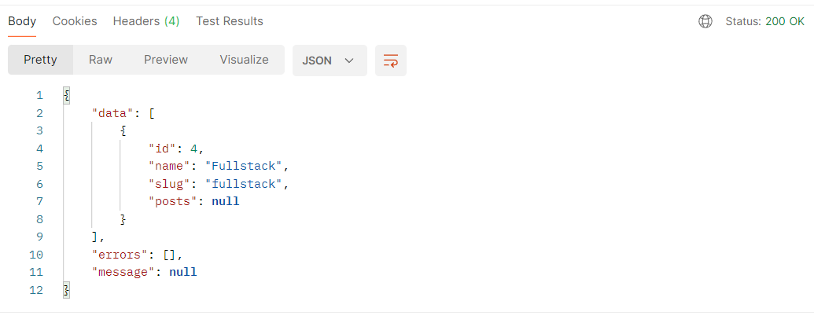

***Padronizando os retornos da API***
Antes, alguns retornos eram simples string, as vezes um retorno num formato padronizado pelo aspnet, entre outros.
Mas ter um formato padrão facilita para o nosso frontend na hora da tratativa desses retornos.

**Retorno de erros**

**Retorno de sucesso**

